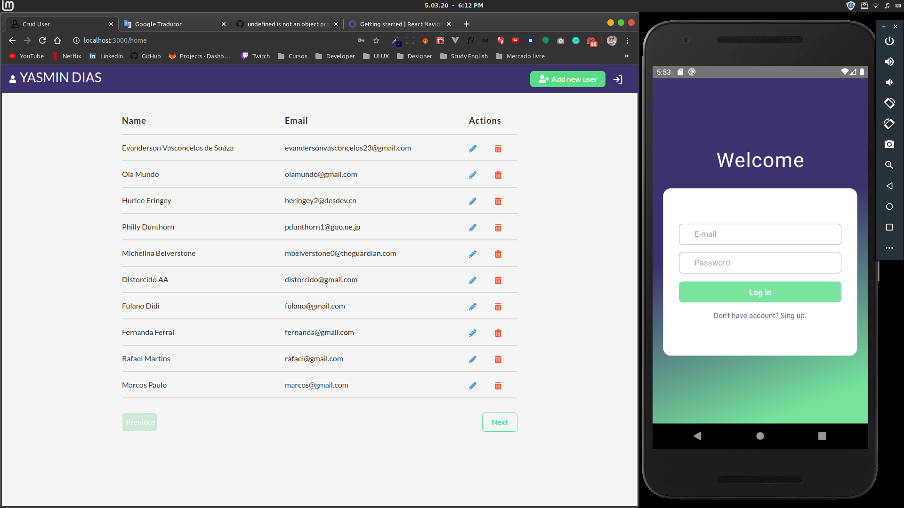

<h1 align="center">
  CRUD OF THE USERS FOR TECLA T - TEST FULLSTACK JS

   
   

    
</h1>

A little description about your project

  

### - STEPS TO CREATION DATABASE

<a href="https://docs.mongodb.com/guides/server/install/" target="_blank">mongoDB</a>

- You will need to have installed the <a href="https://docs.mongodb.com/guides/server/install/" target="_blank">mongoDB</a> click this link and install case you don't have.

- Open the terminal and run these codes.

> mongo

> use crudUsers;

- In this step copy and paste the code into that are the folder backend/ _db.json_ and run in your terminal.

> db.users.insertMany(_db.json_);

- Now was created 55 users with (name, email and Password).

### - RUNNING APP IN LOCALHOST

- In your terminal with the folder backend opened, run the steps:

> `yarn` or `npm install` **for install the modules**.

> `yarn dev` or `npm run dev`.

- In your terminal with the folder frontend opened, run the steps:

> `yarn` or `npm install` **for install the modules**.

> `yarn start` or `npm run start`.

#### In these steps, you can access in your browser the web application.

- To make login click to signup and then to create your user to access the app.

### - RUNNIG THE VERSION MOBILE:

- In your terminal with the folder mobile opened, run the steps:

- Using expo:

> `yarn` or `npm install` **for install the modules**.

> You will need to have the app <a href="https://play.google.com/store/apps/details?id=host.exp.exponent&hl=pt_BR" target="_blank">Expo</a> in your phone.

> `yarn start` or `npm run start` **After that will open in your browser one QRCODE, capture and will run in your phone**.

---

### - FEATURES

- ⚛️ **<a href="https://pt-br.reactjs.org/docs/getting-started.html" target="_blank">React Js</a>** — A JavaScript library for building user interfaces
- ⚛️ **<a href="https://reactnative.dev/docs/getting-started" target="_blank">React Native</a>** — A lib that provides a way to create native apps for Android and iOS
- 💹 **<a href="https://nodejs.org/en/" target="_blank">Node Js</a>** — A web framework for Node Js

### - LICENSE

This project is licensed under the MIT License - see the <a href="https://opensource.org/licenses/MIT" target="_blank">LICENSE</a> page for details.
